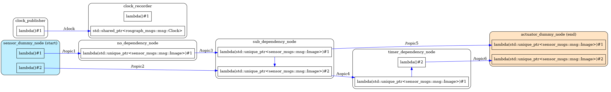

## architecture ファイルの作成

アーキテクチャファイルは、E2E レイテンシの算出にあたり必要な情報を記述したファイルです。  
トレースした CTF ファイルから雛形を作成できますが、一部手作業での修正が必要になります。  
※ テスト対象が通信レイテンシやコールバックの実行時間のみの場合、手作業での修正は不要です。

ここでは、[e2e_demo](https://github.com/hsgwa/e2e_demo)を例に、アーキテクチャファイルの作成および修正の方法を説明します。


[](../imgs/how_to_create_architecture_file.png)

* TOC
{:toc}

### 雛形の作成

雛形はトレース結果から生成できます。

```bash
$ ls ~/.ros/tracing/e2e_demo # トレースファイルのパスを確認
ust
$ . ~/ros2_ws/install/setup.bash # コマンドのパスを通す
$ # trace_create_template [/path/to/trace_result] [/path/to/architecture]
$ trace_create_template ~/.ros/tracing/e2e_demo ./architecture.json
$ cat ./architecture.json
{
  "target_path": {},
  "..." []
}
```

### アーキテクチャファイルの可視化

生成されたアーキテクチャファイルは以下のコマンドで可視化できます。

```bash
$ # trace_draw_node_graph [/path/to/architecture] [/path/to/png]
$ trace_draw_node_graph ./architecture.json ./architecture.png
0 end-to-end paths found.
5 nodes, 1 node paths found.
6 communication found.
9 callbacks found.
Failed to find start node. Please set [/target_path/start_node_name].
Failed to find end node. Please set [/target_path/end_node_name].
5 communications have no callback name. Please set [/nodes/publish/topic].
$ ls ./architecture.png
./architecture.png
```

architecture.png には、コールバックを含んだノード図が出力されます。

[](../imgs/node_graph_temp.png)

青の実線で描かれた矢印はコールバックからコールバックへの依存が記述されているパスを示し、  
黒の点線で描かれた矢印はノードからコールバックへの依存までしか記述されていないパスを示しています。

### アーキテクチャファイルの修正

出力直後の雛形は、コールバックの依存関係などが記述されません。  
End-to-End レイテンシなどの値を算出する際には、
手動でアーキテクチャファイルの修正が必要になります。

※ コールバックの実行時間や通信時間のみの測定の場合には省略が可能です。  
詳細は[グラフの一覧と出力対応状況](./how_to_read_graph.md)をご覧ください。

修正が必要な項目は以下になります。

1. End-to-End の始点と終点を設定
   1. [/target_path/start_node_name]に始点となるノード名（名前空間含む）を記述します。
   2. [/target_path/end_node_name]に終点となるノード名（名前空間含む）を記述します。
2. コールバック関数と publish するトピック名の紐付け
   1. [/nodes/node_obj/publish] には、ノードが publish しているトピック名が key として列挙されています。  
      value にトピックを publish  しているコールバックの symbol を記述してください。
   3. trace_draw_node_graph コマンドで可視化した際、すべてが青矢印になるまで繰り返します。
3. コールバック関数間の依存関係の記述
   1. ノード内にコールバック間の依存関係が存在する場合、
      [/nodes/node_obj/callback_dependency] にコールバックの依存関係を key と value で記述します。  
      `callback_A -> callback_B` の依存関係がある場合、`"callback_A の symbol 名" : "callback_B の symbol 名"`と記述してください。
   2. trace_draw_node_graph コマンドで可視化した際、必要な依存関係がすべて表現されるまで繰り返します。
4. パス名のエイリアス（任意）
    1. 測定対象のパス名に名前を付ける場合、`path_name_alias`にパス名のエイリアスを設定します。
    2. `"対象のパス名": "パス名のエイリアス"`と記述してください。

e2e_demo の場合の修正は以下のようになります。  
雛形と修正済みアーキテクチャファイルの差分は [Github の Diff](https://github.com/hsgwa/e2e_demo/commit/2393e46f86a30da47c1b4105c721ed291767234b?branch=2393e46f86a30da47c1b4105c721ed291767234b&diff=unified#diff-93c948d761539ffdf446c5c5744ccdbd1d246c792bfcec38a32afdf993ea3cff) をご覧ください。

[](../imgs/architecture_modification.png)


最終的には以下のような状態になります。

```
$ trace_draw_node_graph ./architecture.json ./architecture.png
3 paths found.
```

[](../imgs/node_graph.png)

青ノードが End-to-End の始点ノード、黄ノードが End-to-End の始点ノードを示しています。  
すべての矢印（コールバックの依存関係）が青色の実線で、それぞれの線がコールバックからコールバックまでつながっています。

### アーキテクチャファイルのフォーマット

先頭に ※ がある項目が手動での変更が必要になる項目です。  
修正結果は `trace_draw_node_graph` コマンドで確認できます。

```json
{
  "target_path": {
    "start_node_name": "※ End-to-End の開始ノード名",
    "end_node_name": "※ End-to-End の終了ノード名"
  },
  "nodes": [
    {
      "name": "ノードの名前",
      "callback_dependency": {
        "※コールバックのシンボル名": "※ 後続するコールバックのシンボル名"
      },
      "publish": {
        "トピック名": "※ トピックをパブリッシュするコールバクのシンボル名"
      },
      "callbacks": [
        {
          "type": "コールバックのタイプ (timer_callback)",
          "period": "タイマーの周期 (ns)",
          "symbol": "コールバックのシンボル名"
        },
        {
          "type": "コールバックタイプ (subscribe_callback)",
          "topic_name": "サブスクライブするトピック名",
          "symbol": "コールバックのシンボル名"
        }
      ]
    }
  ]
  "path_name_alias": {
    "命名対象のパス名": "命名するパスの名前"
  }
}
```
