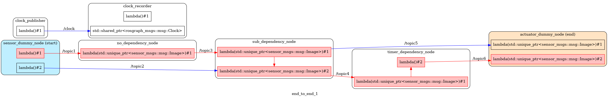

## CI への組み込み

本ツールはテスト要件を yaml  で入力し、テストサマリを yaml で保存するインターフェースがあります。  
このインターフェースを利用することで、システムのテストを CI へ組み込むことが可能になります。

* TOC
{:toc}
### テスト要件 yaml の作成

#### フォーマット

テスト要件 yaml は以下のようなファイルを作成します。

```yaml
end_to_end_1 (ms): # レイテンシ・実行時間のテスト対象　[テスト可能な対象 (ms)]
  mean:             # 平均値のテスト
    desired: 40     # 理想
    acceptable: 70  # 許容値
  peak:             # 最大値のテスト
    desired: 70
    acceptable: 90

/topic1_0 (ms): # テスト対象が複数の際は列挙が可能
  mean:
    desired: 40
    acceptable: 70
  peak:
    desired: 70
    acceptable: 90
```

#### テスト可能な対象の一覧取得

本ツールはコールバックの実行時間から End-to-End にわたり、数多くのテスト対象の候補が存在します。  
テスト可能なパスの名前は以下のコマンドで取得できます。

```bash
$ # trace_list_target [/path/to/trace_result] [/path/to/architecture.json]
$ trace_list_target ~/.ros/tracing/e2e_demo ./architecture.json
/topic1_0
/topic1_dds_0
...
timer_dependency_node_1
```

#### テスト対象のパスの確認

テスト対象のパスは以下のコマンドで確認できます。

````bash
$ trace_draw_node_graph ./architecture.json ./architecture.png end_to_end_1
````

[](../imgs/node_graph_target.png)
`target_path`に含まれるパスが赤く強調されます。

### テスト実行

テスト要件 yaml 生成後は以下のコマンドでテストサマリ yaml を生成できます。

```bash
$ # テストサマリと図の生成
$ # trace_analysis [/path/to/input.yml] [/path/to/export_dir] [/path/to/trace_result] [/path/to/architecture.json]
$ trace_analysis ./input.yaml . ~/.ros/tracing/e2e_demo/ ./architecture.json

$ # flamegraph の生成
$ # trace_collapse [/path/to/export_dir] [/path/to/trace_result] [/path/to/architecture.json]
$ trace_collapse . ~/.ros/tracing/e2e_demo/ ./architecture.json
$ find . -name "*.log"  \
  | xargs -I@ sh -c \
   'flamegraph.pl @ --countname ms > $(dirname @)/$(basename @ _collapsed.log).svg'
```

コマンド実行後のディレクトリの状態は以下のようになります。

```
analysis/
├── architecture.json
├── graph # 図は graph ディレクトリ内に格納される
│   ├── ActuatorDummy::ActuatorDummy()::{lambda(std::unique_ptr<sensor_msgs::msg::Image>)#1}-hist.png
│   ├── ActuatorDummy::ActuatorDummy()::{lambda(std::unique_ptr<sensor_msgs::msg::Image>)#1}-timeseries.png
│   ├── ...
│   ├── end_to_end1.svg # flame graph
│   └── topic6_dds_0-timeseries.png
├── input.yaml  # テスト要件 yaml
└── output.yaml # サマリ yaml
```

### テストサマリ yaml  の読み方

#### フォーマット

テスト結果は output.yaml に保存されます。

```yaml
/topic1_0 (ms):         # テスト対象
  evaluation: desired   # テスト結果 desired / acceptable / not_acceptable のいずれかの値
  graph-path:
    histogram: graph/topic1_0-hist.png # 対応する図への相対パス
    timeseries: graph/topic1_0-timeseries.png
  mean:                 # 平均値
    evaluation: desired # テスト結果 desired / acceptable / not_acceptable のいずれかの値 
    value: '0.0'        # 測定結果
  peak:                 # 最大値
    evaluation: desired # テスト結果　desired / acceptable / not_acceptable のいずれかの値
    value: '1'          # 最大値
  std:                  # 標準偏差
    value: '0.0'
end_to_end_1 (ms):
  evaluation: not_acceptable
  graph-path:
    histogram: graph/end_to_end_1-hist.png
  mean:
    evaluation: not_acceptable
    value: '160.3'
  peak:
    evaluation: not_acceptable
    value: '321'
  std:
    value: '51.5'
```

※ 統計値の算出には ms オーダーに丸めた値を使用しています。
