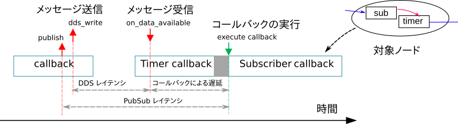
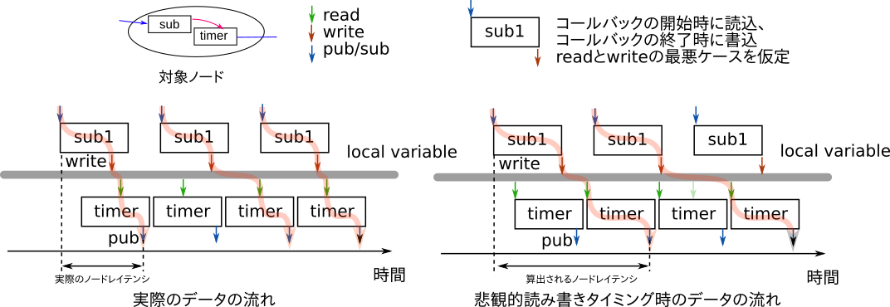

本ツールが測定する指標の定義を説明します。

- End-to-End レイテンシ
- ノードレイテンシ
- 通信
  - pub-sub レイテンシ
  - DDS レイテンシ
  - メッセージロスト
- コールバック実行時間
- コールバック間レイテンシ
 - メッセージロスト

* TOC
{:toc}

<script type="text/x-mathjax-config">MathJax.Hub.Config({tex2jax:{inlineMath:[['\$','\$'],['\\(','\\)']],processEscapes:true},CommonHTML: {matchFontHeight:false}});</script>
<script type="text/javascript" async src="https://cdnjs.cloudflare.com/ajax/libs/mathjax/2.7.1/MathJax.js?config=TeX-MML-AM_CHTML"></script>

### トレース箇所の定義
本ツールは LTTng のトレースポイントと、DDS から取得可能な情報である rmw_service_info_t を利用して測定をしています。  
測定している箇所は以下の通りです。

| 名称                      | 測定箇所                             | 挿入レイヤー | 説明                                                                                                             |
|---------------------------|--------------------------------------|--------------|------------------------------------------------------------------------------------------------------------------|
| ros2:rclcpp_publish       | publish()の実行直後                  | rclcpp       | LTTng トレースポイント。ノード・トピック名・ header.stamp と紐付け                                               |
| update source_timestamp   | dds_write()の実行直後                | 各 DDS       | rmw_service_info_t の source_timestamp。                                                                         |
| update received_timestamp | on_data_available() の実行直前       | 各 DDS       | rmw_service_info_t の received_timestamp。  ※ on_data_available は DDS スレッドがメッセージ受信後に実行する関数 |
| ros2:rclcpp_subscribe     | subscribe コールバックの実行開始直前 | rclcpp       | LTTng トレースポイント。ノード・トピック名・ header.stamp と紐付け </br> rmw_service_info_t の情報も同時に出力   |
| ros2:callback_start       | 各コールバックの実行開始直前         | rclcpp       | LTTng トレースポイント。ノード・コールバックと紐付け                                                             |
| ros2:callback_end         | 各コールバックの終了直後             | rclcpp       | LTTng トレースポイント。ノード・コールバックと紐付け                                                             |

以下にトレースポイントを示したシーケンス図を示します。

[](../imgs/trace_point.png)

黄色は既存のトレースポイント、赤色は新規または修正を加えたトレースポイントを示しています。  
※ 利用するエグゼキュータによって処理が異なる上、やや厳密性に欠けた表記の箇所があります。

### 基本的な考え方
本ツールは End-to-End レイテンシやノードレイテンシの算出にあたり、  
算出対象となるパスのコンポーネントを

- End-to-End レイテンシ = ノードレイテンシ＋通信レイテンシ
- ノードレイテンシ = コールバック実行時間＋コールバック間のレイテンシ

として２段階分解し、それらコンポーネントの処理に要したレイテンシの総和をとります。

コンポーネントの分解を階層構造として示すと以下のようになります。

```
End-to-End
├── Pub-Ssub Communication	通信＆スケジューリング：publish() から callback() 実行直前まで
└── Node                    subscribe や timer コールバックの開始から publish するコールバックの終了まで
    ├── Callback            コールバックの実行時間：callback() 開始直前から callback() 終了直後まで
    └── Inter-callback      コールバック間の時間： callback() 終了直後から callback() 開始直前まで
```

ここで、Inter-callback とは、コールバック間にメンバ変数を介した依存関係がある場合の、コールバック終了直後から次のコールバック実行直前までのレイテンシのことを指しています。  
単一のノード内のパスでコールバックが一つしか実行されない場合には Inter-callback は含みません（下図参照）

[](../imgs/path.png)


ノードレイテンシと End-to-End レイテンシは下階層のレイテンシの重ね合わせによって計算するので、  
実際に測定するのは、Pub-sub 通信レイテンシ、コールバック実行時間、コールバック間のレイテンシ、の３つになります。  

また、上図には DDS レイヤーでの通信に要した時間（DDS Communication）を記載してますが、  
ボトルネックの特定用に測定しているものであり、 End-to-End レイテンシの算出には使用していません。

### 定義

End-to-End レイテンシの算出にあたり、測定が必要な項目は 

- 通信レイテンシ $$L_{\rm{PubSub}}$$
- コールバック実行時間  $$L_{\rm{cb}}$$
- コールバック間のレイテンシ $$L_{\rm{icb}}$$

になります。

ここでは、上記３つの算出方法と、複合的なレイテンシであるノードレイテンシ・ End-to-End レイテンシに分けて説明します。

#### 直接算出するレイテンシ（通信レイテンシ、コールバック実行時間、コールバック間レイテンシ）
それぞれのレイテンシは以下の式で算出されます

$$ 
\begin{eqnarray}
L_{\rm{cb}} &=& T_{\rm{cb}}^{\rm{end}} - T_{\rm{cb_start}}^{\rm{start}} \\
L_{\rm{icb}} &=& T_{\rm{cb}}^{\prime\rm{start}} - T_{\rm{cb}}^{\prime\rm{end}}  \\
L_{\rm{PubSub}} &=& T_{\rm{Sub}} - T_{\rm{Pub}} \\
L_{\rm{DDS}} &=& T_{\rm{data_available}} - T_{\rm{write}}
\end{eqnarray}
$$

ここで、それぞれの時刻$$T$$は以下のトレースポイントに対応します。

- $$T_{\rm{cb}}^{\rm{start}}$$ と $$T_{\rm{cb}}^{\prime\rm{start}}$$ はコールバックの実行開始時刻（ros2:callback_start）
- $$T_{\rm{cb}}^{\rm{end}}$$ と $$ T_{\rm{cb}}^{\prime\rm{end}}$$はコールバックの実行終了時刻（ros2:callback_end）
- $$T_{\rm{Sub}}$$はサブスクライブコールバックの実行開始時刻（ros2:rclcpp_subscribe）
- $$T_{\rm{Pub}}$$はパブリッシュの実行時刻（ros2:rclcpp_publish）
- $$T_{\rm{write}}$$は dds_write の実行時刻（source_timestamp）
- $$T_{\rm{available}}$$は on_data_available の実行時刻（received_timestamp）

レイテンシの算出にあたり、測定開始と測定終了の時刻は以下のように対応させています。

- $$T_{\rm{cb}}^{\rm{end}}$$は$$T_{\rm{cb}}^{\rm{end}}$$の直後のトレースポイント。同一コールバックでマッチング。
- $$T_{\rm{cb}}^{\prime\rm{start}}$$は$$T_{\rm{cb}}^{\prime\rm{end}}$$の直後のトレースポイント。依存元コールバックと依存先コールバックでマッチング。
- $$T_{\rm{Sub}}$$は$$T_{\rm{Pub}}$$直後のトレースポイント。Pub トピック名と Sub トピック名でマッチング。

なお、$$T_{\rm{cb}}^{\prime\rm{start}}$$と$$T_{\rm{cb}}^{\prime\rm{end}}$$、$$T_{\rm{Sub}}$$と$$T_{\rm{Pub}}$$は実行されず、対応がとれないケースがあります。  
このような対応がとれないケースを「メッセージのロスト」としてカウントしています。

- PubSub 間のメッセージロスト数 = $$T_{\rm{Pub}}$$の数 - $$T_{\rm{Sub}}$$の数
- コールバック間のメッセージロスト数 = $$T_{\rm{cb}}^{\prime\rm{end}}$$の数 - $$T_{\rm{cb}}^{\prime\rm{start}}$$ の数

#### 間接的に算出するレイテンシ（ノードレイテンシ、End-to-End レイテンシ）
ノードレイテンシと End-to-End レイテンシは直接的に測定せず、  
通信レイテンシ・コールバック実行時間・コールバック間レイテンシをかけ合わせた複合的な値として算出しています。

ここでは、「基本的な考え方」で説明した内容をさらに具体的にした説明をします。

<br />

End-to-End レイテンシは、対象のパス内に含まれるノードレイテンシと通信レイテンシの総和で表現されます。  
（End-to-End や Node は入力と出力が複数あり、複数のパスが存在します。）

$$ L_{\rm{E2E}} = \sum _{\in \rm{path}}L_{\rm{Node}} + \sum_{\in \rm{path}}L_{\rm{PubSub}}$$

ここで、$$L_{\rm{E2E}}$$ は End-to-End レイテンシ、$$L_{\rm{Node}}$$ はノードレイテンシ、$$L_{\rm{PubSub}}$$ は通信レイテンシを示しています。

さらに、ノードレイテンシは、対象のパス内に含まれるコールバックの実行時間とコールバック間のレイテンシの総和で表現されます。

$$ L_{\rm{Node}} = \sum_{\in \rm{path}}L_{\rm{cb}} + \sum_{\in \rm{path}}L_{\rm{icb}} $$

ここで、$$L_{\rm{cb}}$$はコールバックの実行時間、$$L_{\rm{icb}}$$はコールバック間のレイテンシを示しています。

実際には、確率分布と時系列の加算は以降で説明する方法で計算しています。

##### 確率分布の重ね合わせ
レイテンシの確率分布の加算は、離散化した確率分布の畳み込み積分で算出します。

レイテンシの確率分布 が P1 となるシステム S1 と、レイテンシの確率分布が P2 となるシステム S2 を想定します。  
このとき、確率分布 P1 と P2 は直接算出可能なレイテンシ（コールバックの実行時間や通信レイテンシ）のヒストグラムを正規化して得られます。

[](../imgs/hist_add_diagram.png)

P1 と P2 はそれぞれ、 [x1,x2)のように一定の幅を持った区間のレイテンシとなる確率を示しています。  
ここで、それぞれの区間の幅を bin size と言い、本ツールでは ns の単位で指定できます 。

| Latency X | [x1,x2) | [x2,x3) | [...,...) | [xn-1,xn) | [xn, xn+1) |
|-----------|---------|---------|-----------|-----------|------------|
| P1(X)     | p1(1)   | p1(2)   | ...       | p1(n-1) | p1(n)    |
| P2(X)     | p2(2)   | p2(3)   | ...       | p2(n-1) | p2(n)    |

このとき、システム１とシステム２を足し合わせたレイテンシの確率分布を以下の式で算出しています。

$$ P(X) = \sum_{t=0} P1(t)\frac{1}{2} \{P2(X-t) + P2(X-t-1)\}$$

この式は P1 と P2 の畳み込み積分になっています。  
P2 の確率を$X-t$と$$X-t-1$$で平均を取っているのは、確率分布の幅を考慮させるためです。

TODO: 幅を考慮させるために平均を取っている理由（導出過程）を記述

##### 計算例
確率分布の加算をした例を示します。

確率分布 P1,P2 およびそのレイテンシを合算した確率分布 P12 を考えます。

| Latency X | [0,1) | [1,2) | [2,3) | [3,4) | [4,5) | [5,6) |
|-----------|-------|-------|-------|-------|-------|-------|
| P1(X)     |     0 |   0.5 |   0.5 |     0 |     0 |     0 |
| P2(X)     |     0 |     1 |     0 |     0 |     0 |     0 |

[](../imgs/hist_add.png)

ここで、P12 は次式で求められます。

$$
\begin{eqnarray}
P12(3) &=& P1(2) \times \frac{1}{2} \{ P2(1) + P2(0) \} = 0.25 \\
P12(4) &=& P1(2) \times \frac{1}{2} \{ P2(2) + P2(1) \} + P1(3) \times \frac{1}{2} \{P2(1) + P2(0)\} = 0.5 \\
P12(5) &=& P1(3) \times \frac{1}{2} \{ P2(2)+P2(1) \} = 0.25
\end{eqnarray}
$$

| Latency X | [0,1) | [1,2) | [2,3) | [3,4) | [4,5) | [5,6) |
|-----------|-------|-------|-------|-------|-------|-------|
| P12(X)    |     0 |     0 |  0.25 |   0.5 |  0.25 |     0 |

計算した P12 の確率分布から、足し合わせたシステムの最大レイテンシは 5 になります。

##### 時系列の構築

レイテンシの時系列は、時系列順にシステム毎で測定した最新のレイテンシを加算することにより算出します。

システム S1 のレイテンシを測定した table1 と、システム S2 のレイテンシを測定した table2 を想定します。

[](../imgs/timeseries_add_diagram.png)

このとき、次の図に示すように時系列順に最新のレイテンシ同士を加算します。

[](../imgs/timeseries_table_add_diagram.png)

疑似コードで書くと次のようになります。

```
table12 = concatenate(table1, table2) sorted by t

for each row in table12
    if row in table1 then
	    L1' = row[L]
	else if row in table2 then
	    L2' = row[L]

	L12 = L1' + L2'
	t12 = row[t]
```


### PubSub レイテンシと DDS レイテンシの違い
rmw_service_info_t を利用した DDS レイテンシはボトルネックを特定する際に確認する指標であり、  
End-to-End レイテンシの算出には使用していないレイテンシです。  

ここでは、DDS レイテンシと PubSub レイテンシの違いについて説明します。  

DDS レイテンシと PuSub レイテンシは「定義」で説明した通り、測定対象に加え、測定する目的が異なります。

[](../imgs/dds_vs_pubsub.png)

| 比較対象     | PubSub レイテンシ                        | DDS レイテンシ                        |
|--------------|------------------------------------------|---------------------------------------|
| 目的         | End-to-End レイテンシの算出              | 通信由来のボトルネック特定            |
| 測定箇所     | Publish()から Subscribe コールバック実行 | dds_write から on_data_available まで |
| 測定レイヤー | (App), rclcpp, rcl, rmw, DDS             | DDS                                   |


DDS レイテンシの基本的なアイデアは DDS レイヤーでの通信のみを測定することです。  
PusSub レイテンシではエグゼキュータにより、優先度の高いコールバックの影響を受けるため、通信のみの測定ができません。

<br />

PubSub レイテンシでは通信のみの測定ができない例を示します  
ここでは、Subsribe と Timer コールバックを含むノードを想定します。  

Single thread executor は Timer コールバックを優先するので、  
タイマーの起床とメッセージの受信が重なった際、  
Timer コールバックの実行が終了するまで Subscriber コールバックを実行開始（測定終了）しません。  
このとき、下図で示す「コールバックによる遅延」が生じます。  

一方で、DDS レイテンシはコールバック実行とは別の DDS が生成するスレッドに計測の終了をさせるので、  
コールバックによる遅延は発生しません。

[](../imgs/dds_latency.png)

### 指標を取り扱う上での注意
End-to-End レイテンシの算出にあたり、$$T_{\rm{Pub}}$$はコールバックの終了時、コールバック間を依存させるメンバ変数の更新はコールバックの終了時として、仮定しています。  
実際には、コールバック実行の中間や開始時に行われることがあり、本ツールで算出するレイテンシは悲観的な値の算出となっています。

[](../imgs/pessimistic_estimation.png)

<br />

ノードレイテンシと End-to-End レイテンシは測定値ではなく、あくまでも測定値をベースに算出した推定値です。


