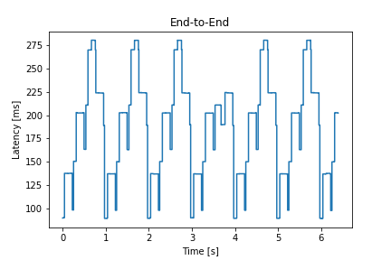
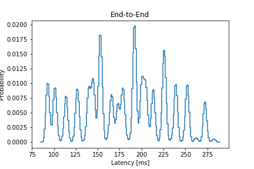
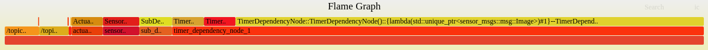

## グラフの種類とグラフの見方

本ツールは３種類の可視化方法があります。

- レイテンシ／実行時間の確率分布
- レイテンシ／実行時間の時系列
- flame graph

ここでは、それぞれのグラフについて説明します。

* TOC
{:toc}

### グラフの一覧と出力対応状況

本ツールは採用しているレイテンシの算出方法により、  
時系列の出力が不可能な項目や、アーキテクチャファイルへの修正が不要な項目があります。

以下に出力の対応状況をまとめます。

| 計測対象                                  | 時系列                   | 確率分布                     | アーキテクチャファイルの修正 |
| ----------------------------------------- | ------------------------ | ---------------------------- | ---------------------------- |
| flamegraph                                | 不可                     | 不可<br />（最大値のみ利用） | 必要                         |
| End-to-End レイテンシ                     | 非対応<br />（対応予定） | 対応                         | 必要                         |
| ノードレイテンシ                          | 非対応<br />（対応予定） | 対応                         | 必要                         |
| 通信レイテンシ<br />（ ROS&DDS レイヤー） | 対応                     | 対応                         | 不要                         |
| 通信レイテンシ<br />（ DDS レイヤー）     | 対応                     | 対応                         | 不要                         |
| コールバック実行時間                      | 対応                     | 対応                         | 不要                         |
| コールバック間のレイテンシ                | 対応                     | 対応                         | 必要                         |

### 時系列

横軸：システム時刻／rostime（clock_recorder で/clock をトレースする必要あり）  
縦軸：レイテンシ

[](../imgs/timeseries_sample.png)

### 確率分布

横軸：レイテンシ
縦軸：確率（ヒストグラムを１に正規化した値）

[](../imgs/hist_sample.png)


### flame graph

本ツールは以下のように、測定対象が階層構造になっています。

```
End-to-End
├── Communication	通信＆スケジューリング：publish() から callback() 実行直前まで
│   └── DDS			通信：dds_write から on_data_available() 実行直前まで
└── Node            subscribe や timer コールバックの開始から publish するコールバックの終了まで
    ├── Callback	コールバックの実行時間：callback() 開始直前から callback() 終了直後まで
    └── Schedulling	コールバック間の時間： callback() 終了直後から callback() 開始直前まで
```

解析する際には、上位のレイテンシから下位のレイテンシへ検証していく必要があります。  
jupyter 上での検証も可能ですが、一つのグラフ上にこれら階層構造の各レイテンシを示すために flamegraph への出力に対応しています。

- 上段：DDS レイヤーのレイテンシ／コールバックの実行時間／コールバック間のレイテンシ
- 中段：ROS&DDS レイヤのレイテンシ／ノードレイテンシ
- 下段：End-to-End レイテンシ

[](../imgs/flamegraph.png)

ブラウザで svg ファイルを開くと、カーソルオーバー時にそれぞれのレイテンシの最大値や割合を確認できます。  
[サンプルの flamegraph](../imgs/flamegraph_sample.svg)
