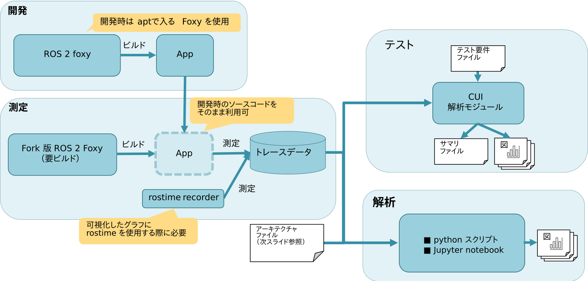
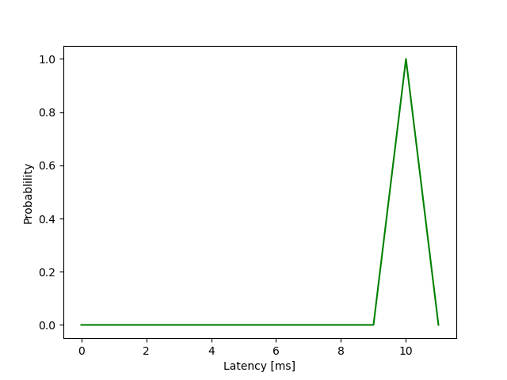
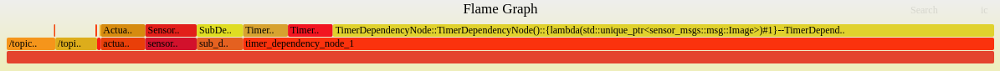

サンプルとして [e2e_demo](https://github.com/hsgwa/e2e_demo) を使い、本ツールで測定する際の流れを説明します。  
同じ手順を踏むことで、任意のアプリケーションの測定が可能です。

デモの実行前に、[Fork 版 Foxy のセットアップ](./setup.md) が必要です。


[](../imgs/overview.png)


* TOC
{:toc}

### アプリケーションのビルド

本ツールの利用にあたって、アプリケーションのビルドは Fork 版 Foxy を使用する必要があります。  
`source /opt/ros/foxy/setup.bash` などのコマンドを .bashrc に記載している場合は、  
いったんコメントアウトすることを推奨します。

```bash
$ mkdir -p ~/ros2_ws/src
$ cd ~/ros2_ws
$ git clone --recursive https://github.com/hsgwa/e2e_demo.git ./src/e2e_demo
$ source ~/ros2_foxy_fork/install/setup.bash # Fork 版 Foxy を使用してビルド
$ colcon build --symlink-install
```

それぞれの e2e_demo リポジトリは以下のパッケージで構成されています。

- e2e_demo
  - 測定対象のアプリケーション。任意のアプリケーション。
  - 測定したい対象の任意のアプリケーションに対応
- clock_recorder
  - /clock トピックを subscribe し、rostime をトレースファイルに出力するアプリケーション。
  - 時系列波形を算出する際にシステム時刻と rostime のマッチングを取るのに必要なパッケージ
- clock_publisher
  - /clock トピックに rostime を publish するアプリケーション。rostime は 0 から１秒刻みで出力。
  - 本アプリケーション専用の rostime を publish するアプリケーション


<br />
なお、任意のアプリケーションで rostime を使用する際は、[clock_recorder](https://github.com/hsgwa/clock_recorder/tree/main)を別途クローンしてビルドが必要です。

### launch ファイルの修正

LTTng はデータの書き込みなどを行うデーモンを使用する際に、セッションを作成する必要があります。  
ここでは、launch 時にセッションを作成するために、launch ファイルに以下を追加します。

※ `e2e_demo/launch/demo.launch.py` には既に追加してあります。

```python
from tracetools_launch.action import Trace

def generate_launch_description():
    return launch.LaunchDescription([
        Trace(
            session_name='e2e_demo', # ~/.ros/tracing/e2e_demo にトレース結果が保存される
            events_kernel=[] # カーネル関連のトレースを無視する
        ),
        ...]
```

なお、rostime を使用する際には、rostime を記録するノードとセッションを別途起動する必要があります。

```python
def generate_launch_description():
    return launch.LaunchDescription([
        # ...
        Trace(
            session_name='e2e_demo_clock',
            events_kernel=[],
            events_ust=['rostime:ros_time']
        ),
       launch_ros.actions.Node(
            package='clock_recorder', executable='recorder', output='screen'
        ),
        ...]
```

tracetools_launch.action.Trace それぞれの引数は以下の通りです。

| 引数          | 説明                                                                          |
|---------------|-------------------------------------------------------------------------------|
| session_name  | LTTng のセッション名。`~/.ros/trace/session_name`にトレース結果が保存されます |
| events_kernel | セッションに記録させるカーネルのイベント名。イベントを記録させない場合は[]を指定。                                                                                   |
| events_ust | セッションに記録させるユーザーランド（ROS レイヤー）のイベント名。イベントを記録させない場合は[]を指定。                                                                                   |

セッションの開始は CUI からも可能です。  
詳細は[測定方法](./measure.md)をご覧ください。


### アプリケーションの実行／測定

修正した launch ファイルを使用し、アプリケーションの実行と測定を行います。

```bash
$ cd ~/ros2_ws
$ . ./install/setup.bash
$ ros2 launch e2e_demo clock_demo.launch.py
# 数秒後に Ctrl+C で測定終了させる
$ # ros2 launch e2e_demo demo.launch.py # rostime を使わない場合はこちらを使用
```

測定結果は`~/.ros/tracing/[session_name]`に Common Trace Format (CTF) 形式で保存されます。

```bash
$ ls ~/.ros/tracing/
e2e_demo  e2e_demo_clock
```

`e2e_demo`にアプリケーションのトレース結果、`e2e_demo_clock`に rostime のトレース結果が保存されます。

トレース結果の ctf ファイルの中身は babeltrace で確認できます。

```bash
$ babeltrace ~/.ros/tracing/e2e_demo/ | grep -e rclcpp_publish -e rclcpp_subscribe
[13:35:59.695765941] (+0.009744472) metis03 ros2:rclcpp_publish: { cpu_id = 0 }, { procname = "sub_dependency", vpid = 103930, vtid = 103930 }, { publisher_handle = 0x5598C02EED70, key_stamp = 1613363759653508235 }
[13:35:59.696416058] (+0.000307531) metis03 ros2:rclcpp_subscribe: { cpu_id = 2 }, { procname = "timer_dependenc", vpid = 103932, vtid = 103932 }, { callback = 0x56530AF757D0, key_stamp = 1613363759653508235, source_stamp = 1613363759695774078, received_stamp = 1613363759696244635 }
```

`ros2:rclcpp_publish`や`ros2:rclcpp_subscribe`は Fork 版で追加したトレースポイントです。  
これらが見当たらない場合、Fork 版を使っていない可能性があります。  
環境変数の設定を確認し、再度ビルドを行ってください。

### アーキテクチャファイルの作成

本ツールは、End-to-End レイテンシ／ノードレイテンシの算出に、  
コールバック間の依存関係などを記述したアーキテクチャファイル（architecture.json）が必要です。  
アーキテクチャファイルの作成については 、[architecture ファイルの作成](./architecture.md) をご覧ください。

なお、本サンプルについては `e2e_demo/analysis/architecture.json` として作成済みです。

### トレース結果の解析

トレース結果の解析には、 jupyter で解析／可視化する方法と、  
テスト項目 yaml でトレース結果を判定する方法があります。  

それぞれの解析方法について説明します。

#### jupyter での解析／可視化

整形したグラフが必要な際には、 jupyter 上でグラフの微調整や作成が適しています。  

jupyter をする際には、サービスを起動します。

```bash
$ . ~/ros2_foxy_fork/install/setup.bash
$ cd ~/ros2_ws/src/e2e_demo/e2e_demo/analysis/
$ jupyter-lab
```

以降はブラウザ上で測定結果の解析および可視化が行えます。  
可視化方法はサンプルに付属しているサンプルや、[jupyter での解析](./jupyter_analysis.md) をご覧ください。


- e2e_latency.ipynb ：End-to-End レイテンシの可視化
- node_latency.ipynb ：ノードレイテンシの可視化
- comm_latency.ipynb：通信レイテンシの可視化
- callback_duration.ipynb：コールバック実行時間の可視化
- cui.ipynb：CUI ツールの実行

#### テスト要件 yaml でのトレース結果判定

CI への組み込みを可能にするため、テスト要件を記述したファイルを入力し、    
それに基づいて測定結果を判定するインターフェースを用意しています。  
テスト要件 yaml で測定結果を判定する方法を説明します。

ここでは、結果を判定する方法の流れを説明します。  
テスト要件 yaml とサマリ yaml に関する詳細は [CI への組み込み](./ci.md) を参照ください。

##### テスト要件 yaml の作成

```bash
$ cat input.yaml
end_to_end_1 (ms):
  mean:
    desired: 40
    acceptable: 70
  peak:
    desired: 70
    acceptable: 90
```

##### 測定結果の判定

```bash
$ # trace_analysis [path to input.yaml] [export_dir_path] [trace_data_path] [path to architecture.json]
$ trace_analysis ./input.yaml . ~/.ros/tracing/e2e_demo/ ./architecture.json # . カレントディレクトリに結果を出力
```

##### 出力結果

テスト結果のサマリ yaml は `[export_dir_path]/output.yaml` に出力されます。

```bash
$ cat output.yaml
end_to_end_1 (ms):
  evaluation: not_acceptable
  graph-path:
    histogram: graph/end_to_end_1-hist.png
  mean:
    evaluation: not_acceptable
    value: '85.6'
  peak:
    evaluation: not_acceptable
    value: '144'
  std:
    value: '26.8'
```

測定結果のグラフは `[export_dir_path]/graph` に出力されます。  
このとき、テスト要件 yaml で設定していない項目のグラフも全て生成します。

最終的なファイル構成は以下のようになります。

```bash
$ tree .
.
├── architecture.json
├── input.yaml
├── output.yaml
└── graph
    ├── end_to_end_1-hist.png
    ├── ... （テスト対象以外の測定結果も含めて全てのグラフが出力される）
    ├── topic6_0-hist.png
    └── topic6_0-timeseries.png
```

測定結果の例を示します。  
出力されるグラフの種類や、それぞれのグラフの読み方については、[グラフの種類とグラフの見方](./how_to_read_graph.md) をご覧ください。

[](../imgs/hist_sample.png)
[](../imgs/timeseries_sample.png)

### flamegraph の出力

各 End-to-End のパス毎の flamegraph する際は、以下のコマンドを実行します。

```bash
$ cd ~/ros2_ws/src/e2e_demo/analysis
$ trace_collapse . ~/.ros/tracing/e2e_demo/ ./architecture.json
$ find . -name "*.log"  \
  | xargs -I@ sh -c \
   'flamegraph.pl @ --countname ms > $(dirname @)/$(basename @ _collapsed.log).svg'
```

End-to-End のパスごとに以下のような flamegraph が生成されます。
[](../imgs/flamegraph.png)

[flamegraph の svg ファイル](../imgs/flamegraph_sample.svg)を直接ブラウザで閲覧すると、  
カーソルオーバーなどで各レイヤーのレイテンシを確認できます。

